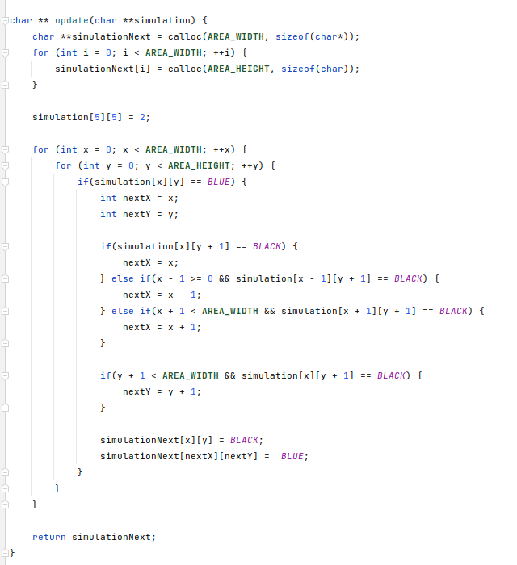
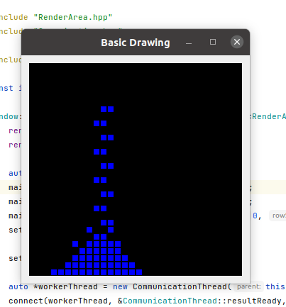

# ClientServerSimulator
A simulator that computes in C and shows the simulation on C++/Qt. You can recompile the simulation in real time, and the server will automatically show it.

## The client computes, and the server shows
### Client:

### Server:

